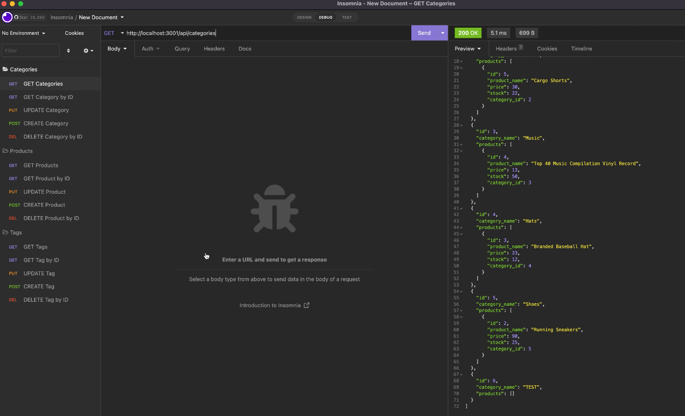

# E-Commerce/Back End

  

  ## Description
  Back end application using a MySQL database. Built for use in e-commerce webapps using MySQL2 and Sequelize packages.
  JavaScript, Express, MySQL2, Sequelize, dotenv

  ## Table of Contents
  - [Installation](#installation)
  - [Usage](#usage)
  - [Tests](#tests)
  - [Contributors](#contributors)
  - [Contact/Questions](#contact/questions)
  - [License](#license)

  ## Installation
  Packages required to run this app are: From your command line, run `npm i` to install dependencies such as MySQL2, Sequelize, and dotenv packages.
  
  ## Usage
  Uses for this app: E-commerce webapps, back end
  
  

  View the demo for this app: [here](./demo/ecom_demo.mov)

  ## Tests
  To test, run the following command: From the command line at the root of the project, run `mysql -u root -p` and enter your mysql password when prompted. Once in mysql, run `source db/schema.sql` to run the schema, then `quit`. Run `npm run seed` to seed the database, then `npm start` to start the server.

  ## Contributors
  Jennifer Blacutt

  ## Contact/Questions
  If you have any questions regarding this project, please reach me via the following methods:
 - Github: [itsjennyb](https://github.com/itsjennyb)
 - Email: [jennifer@blacutt.com](mailto:jennifer@blacutt.com)

  ## License
  This project is licensed under the MIT License.
  For more information, please visit: [MIT Explained](https://choosealicense.com/licenses/mit/)
